# Computer Vision Project: Image-based 3D reconstruction
Project Contributors: Ever and Amy

A Computational Introduction to Robotics, Olin College of Engineering, FA2020

This repository contains code for the computer vision project in which we explored image-based 3D reconstruction from a single camera. Our objective was to be able to get create a 3D reconstruction from two images of the same scene taken from different views. At the conclusion of this project, we were able to get good results on both standard and custom datasets given 2 images taken in uniform lighting.

#### Input Images:
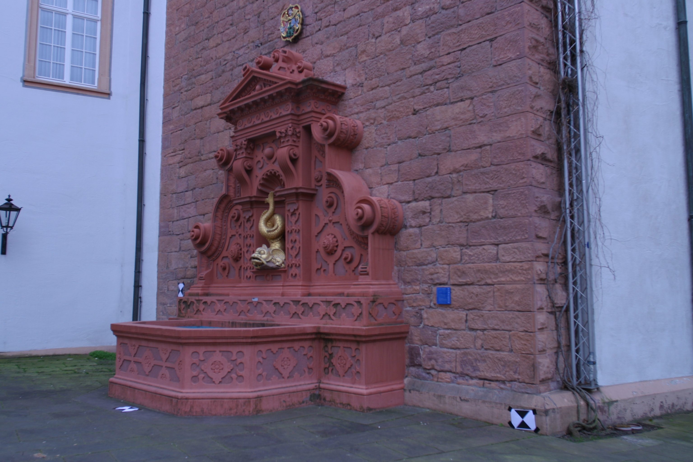
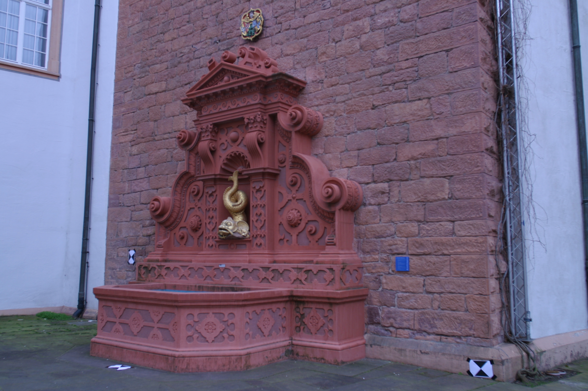

#### Output pointcloud and computed camera positions:
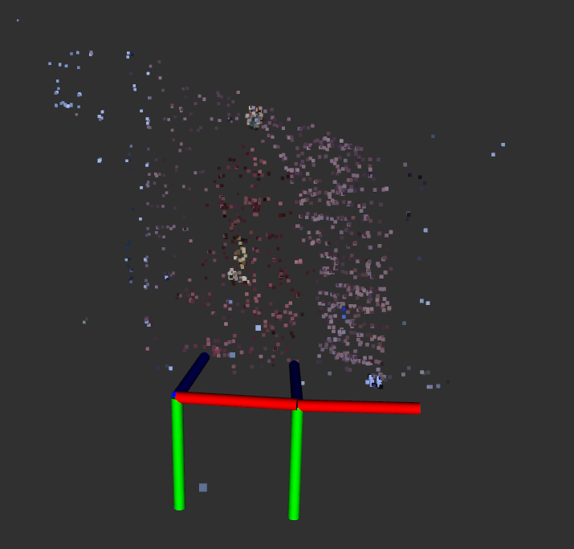

## Running the code
#### Dependency Setup
+ OpenCV
Following https://docs.opencv.org/master/d7/d9f/tutorial_linux_install.html (we need `opencv_contrib` for some of the feature detection functions)
```
# Install minimal prerequisites (Ubuntu 18.04 as reference)
sudo apt update && sudo apt install -y cmake g++ wget unzip
# Download and unpack sources
wget -O opencv.zip https://github.com/opencv/opencv/archive/master.zip
wget -O opencv_contrib.zip https://github.com/opencv/opencv_contrib/archive/master.zip
unzip opencv.zip
unzip opencv_contrib.zip
# Create build directory and switch into it
mkdir -p build && cd build
# Configure
cmake -DOPENCV_ENABLE_NONFREE:BOOL=ON -DOPENCV_EXTRA_MODULES_PATH=../opencv_contrib-master/modules ../opencv-master
# Build
cmake --build .
```

#### Usage
+ `rosrun computer_vision image_reconstruction`
+ Note: Need to change the image path in `image_reconstruction.cpp`

## Methodology
#### Algorithm
Our algorithm is based on the implementation proposed in the Structure from Motion chapter in the text Mastering OpenCV. ([reference](https://www.cs.ccu.edu.tw/~damon/photo/,OpenCV/,Mastering_OpenCV.pdf))
1. Detect  and compute the keypoints in each image using SURF
2. Match keypoints using K Nearest Neighbors
3. Filter the matches using Lowe’s ratio test
4. Calculate the fundamental and essential matrix between the two sets of keypoints
5. Calculate the transform between the two views
6. Visualize epilines
7. Triangulate the points using the transform to create a point cloud
8. Extract colors for points in point cloud from views
9. Display point cloud in RVIZ

#### Testing
To test our algorithm, we first relied on a dataset which included 11 images of a fountain with a provided camera calibration matrix available from this source ([reference](https://github.com/openMVG/SfM_quality_evaluation/tree/master/Benchmarking_Camera_Calibration_2008/fountain-P11/images))

Once we got good results with that dataset, we collected our own dataset using an xbox kinect, which we calibrated using the ROS `camera_calibration` package ([reference](http://wiki.ros.org/camera_calibration)). The process we used was as follows:
+ Create a checkerboard ([reference](https://markhedleyjones.com/projects/calibration-checkerboard-collection))
    + Checkerboard used: A4 - 25mm squares - 8x6 verticies, 9x7 squares
+ Set up kinect drivers: Clone this repo & catkin build https://github.com/ros-drivers/openni_camera
+ Install package to calibrate camera: Run `rosdep install camera_calibration`
+ Start the camera node: Run `roslaunch openni_launch openni.launch`
+ Start the camera calibration node: Run `rosrun camera_calibration cameracalibrator.py --size 8x6 --square 0.025 image:=/camera/rgb/image_raw camera:=/camera/rgb` ([reference](http://wiki.ros.org/camera_calibration/Tutorials/MonocularCalibration))
+ For recording a bagfile, run `rosbag record -j /camera/rgb/camera_info /camera/rgb/image_raw -O raw-img-bagfile1`

After calibration, we tested our implementation with our own set of images taken with the kinect. Due to the low resolution of the kinect camera, the output pointcloud is far less dense than the results with the fountain dataset, but distinct objects are still visible.

##### Custom input images:

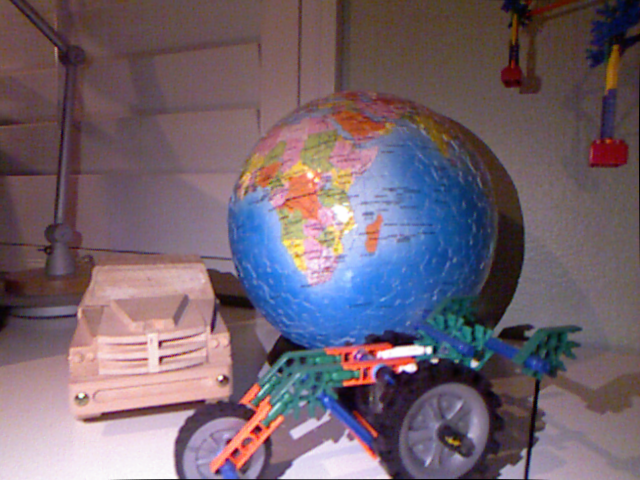
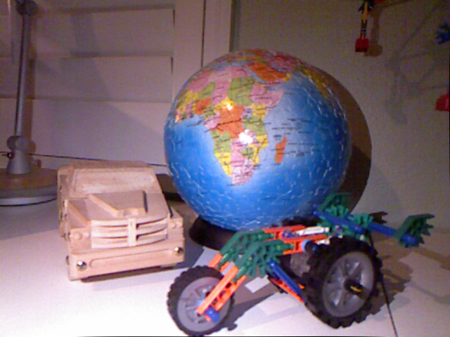

##### Output pointcloud and computed camera positions:

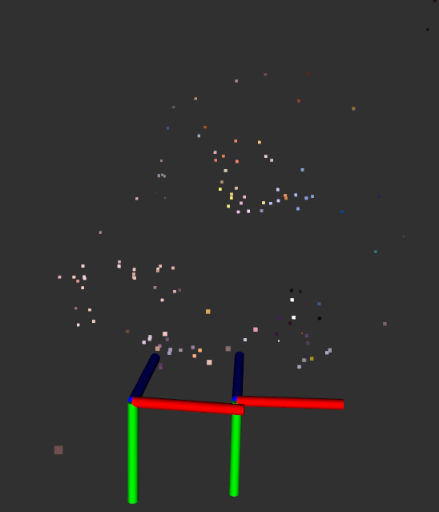
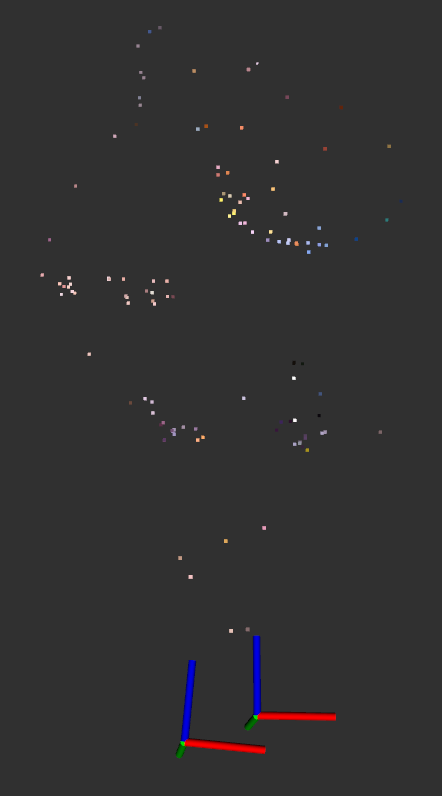

In the left view it's evident that the camera locations look about as we'd expect from the images, but it's difficult to tell the quality of the pointcloud due to it's sparseness. However, looking at the pointcloud from the top-down view (pictured on the right), the distinct roundness of the globe can be seen.

We also tested our implementation on other views and found that the quality of the results significantly drops if it can't find good keypoint matches. In particular, our implementation is particularly sensitive to:
+ low or inconsistent lighting
+ repetitive patterns
+ views that are too different or are too similar to each other

#### Visualization
We wanted to be certain that our algorithm was working as we expected at every step of the way, so we built several visualizations into our algorithm’s pipeline so we could easily understand what it was doing. More details about the rationale behind choosing what visualizations to invest time into can be found in the Challenges section of this report.

These are the visualizations we created:
+ Keypoints and their corresponding epipolar lines
+ Camera Poses estimated relative to each other
+ Colored Point Cloud extracted from matching keypoints

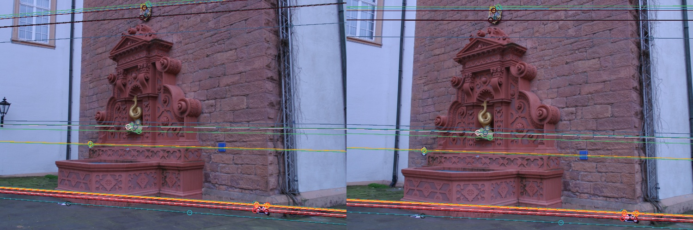

This display puts both views side by side, and shows a subsample of epilines and keypoints. We specifically display a subsample of keypoints and epilines so that it is easier to take a close look at how epilines are being created and keypoints are being matched.

First, let’s look at the colored circles in the scene. These colored circles represent keypoints. Each pair of keypoints shares a color. If a keypoint is green on the left, then there must be a green keypoint on the right that matches that keypoint. Bear in mind that colors are repeated, so you may notice some keypoint pairs that share a color with other keypoint pairs. This is a coincidence.

Let’s take a closer look at the left hand view. We can see a few circles representing key points around the crest at the top of the view, above the fountain. If we take a look at the right hand view, we can see matching key points on the crest, even though the view is different. The colors from the keypoints on the left image correspond to the colors on the right image and the keypoints seem to be detecting the same parts of the crest, so we can conclude that these keypoints are well matched. We see that the rest of the keypoints in this subsample are similarly well matched. This confirms that our keypoint matching works as intended.

The colored lines in the views represent epilines. When we look at the lines on the right hand view, what we’re seeing are the epilines projected from the keypoints in the left hand view. Let’s revisit the points surrounding the crest in the left hand view to get a better idea of what these epilines mean. When we look at these keypoints in the left hand view, we have no clue how far away those points are. We could be looking at a hyper-realistic tiny model of a fountain, or we could be looking at a giant statue of a fountain. As humans, we can gauge the size of the fountain, and thus the distance to various keypoints, by using context clues. We expect bricks, windows, lamps, and drain pipes all to be a certain size, but our algorithm has no sense of that context. Thus, it has no sense of how far away the keypoints in the left hand view are. What it _does_ know is that those keypoints must lie somewhere along a line that the left hand view is looking at straight on, so that the line looks like a single point. However, if we looked at that same line from the right hand view, then we would actually see it as a line since we’re no longer looking at the line straight on. That’s what we call an epiline. We calculated the epilines on the right hand image using only the left hand image and the transformations we previously found between our two camera views. We know these eplines are correct if and only if they cross through the matching keypoints from the right hand image. Each epiline is colored according to the keypoint it came from. Since we see that all of our epilines match the keypoints they cross through, we _know_ that the transformations we calculated were accurate, and we can proceed with certainty to our 3D reconstruction.

 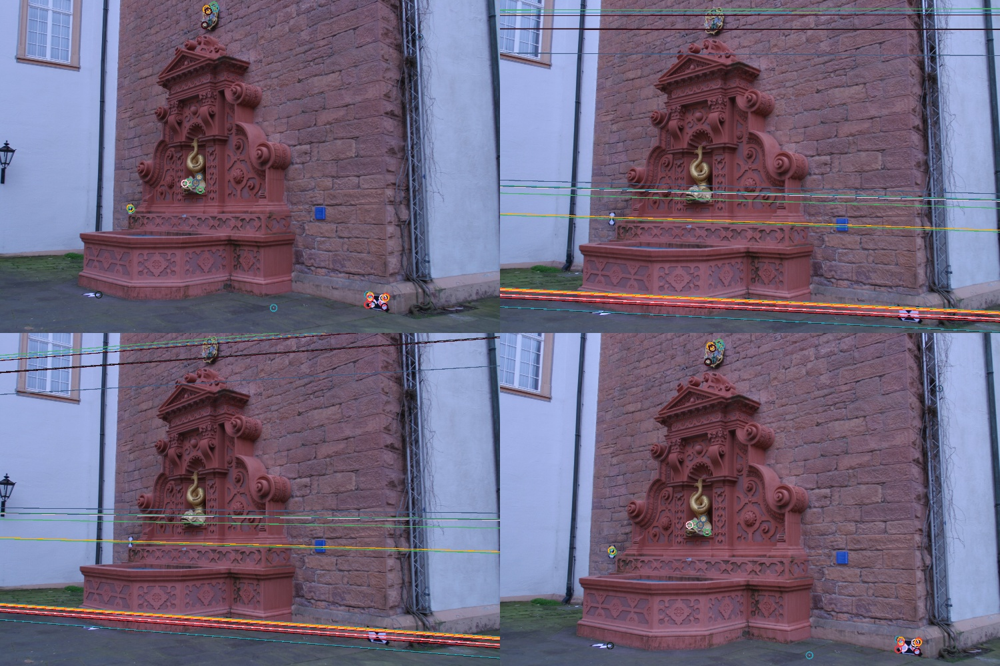

Here we can see the same information, but a bit more easily. On the upper left, we see the subselection of keypoints from the left hand view, and on the upper right we see the corresponding epilines from those keypoints. On the bottom right, we see the subselection of keypoints from the right hand view, and on the bottom left we see the corresponding epilines from those keypoints.


This gif demonstrates the visualization of our 3D point cloud created from the two views. We can see immediately that the color palette closely resembles the palette from the two views. There seems to be a purple-ish plane where the brick wall is, a brown-ish cluster where the fountain is, some blue-ish points scattered across where the adjacent walls are, and a few different colors where the small statue and the crest are. As we rotate the view around, we can clearly see that we’ve managed to reconstruct the wall behind the fountain as a plane, and we can even see part of the corner between the brick wall and the adjacent walls. We can also clearly see that the brown points have taken the general shape of the fountain, with a rounded bottom section and an upper section that protrudes out of the wall. We can see that there are a few outlier points that don’t seem to fit with anything in the images, so our reconstruction does need some touching up to be more accurate, but overall it captures the scene we were trying to recreate quite well.

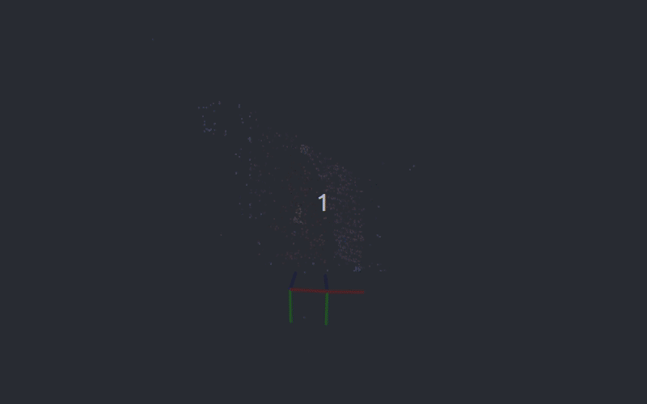

This gif demonstrates the visualization of our 3D point cloud along with two sets of axes representing where our algorithm has determined the camera was when each view was taken. Each colored axis in one set corresponds to the same colored axis in the other set. We see that our blue axis points directly to our point cloud, which means this must be the direction that the camera was facing when each picture was taken. We also see green axes seem to point down and the red axes seem parallel to the ground. This is consistent with what we see in the images, since neither view seems rotated relative to the ground. From one set of axes to the next, we see only a slight rotation, and a small translation, which again, is consistent with our images. The two views look almost identical until we take a closer look at the left and right edges, and realize that the second is shifted slightly to the right. Overall, these camera positions are quite consistent with our images, meaning that along with generating a point cloud, we also estimated the relative motion of the camera in between the two views.

All of this data was published to ROS and visualized in RVIZ

## Design Decisions
We chose to use C++ instead of python due to runtime considerations since we had originally envisioned creating a node that could localize a robot solely based on the camera feed, which would work optimally if the code was quick enough to keep up with the robot’s movements. We also wanted to get more experience writing in C++, and the text we were following had examples in C++ which helped to facilitate that. Ultimately, since we primarily relied on libraries to do the low-level computing, our runtime with the current implementation probably wouldn't change much had we written it with Python or C++. In any case, it was a good learning experience to write it with C++, but it was probably  unnecessary from a design standpoint.

On the code structure side of things, our code makes basic use of functions and runs top-down through the different steps listed in the algorithm section. To display our visualizations, we incorporated additional ROS publishers as necessary to display the colored pointcloud and annotated epilines/keypoints image in RVIZ. While manageable for a project of this size, our structure could be improved with an object-oriented structure with some of the more gritty details of the visualization code moved to a separate file. We could also improve it by incorporating ROS parameters to replace the hard-coded numerical parameters and image paths.

## A Note on Multi-View Reconstruction
Although we didn't get around to implementing it, we did take a good look at what it would take to get a multi-view reconstruction up and running and thought it'd be worth documenting it here for posterity's sake.

At first glance, moving from 2-view to multi-view reconstruction seems relatively straightforward - just take the 2 most recent frames, get the keypoint matches from the two, and add them to the existing pointcloud. However, in practice, this wouldn't work due to issues with scaling - right now, we can only judge the relative scale of the camera motions and the pointclouds, which meant that if we implemented multi-view reconstruction using the proposed method the scaling of the output would vary wildly frame-by-frame, leading to a result that would be unusable for both reconstruction and odometry.

To help fix the relative scaling issue frame-by-frame, we would need to change how we are saving the pointcloud. Right now, we're only saving the 3D data of the individual points, but if we were to move forward with multi-view reconstruction, we'd need to give each point a "metadata" of sorts that tells us what frame we saw it in, and the unique index of the keypoint feature that was used to generate the point.

Once we had that info, we would have the info we'd need to add in the new frame while preserving the relative scale of the current pointcloud. The process we'd use to add in the new frame is as follows:
1. Find the image from the existing set of images that has the highest number of correspondences with the new frame
2. For each keypoint correspondence between the new and old frames, look through the existing pointcloud to see if any of the "old frame" keypoints were used to generate the pointcloud (this is a computationally expensive step - in order to use this to localize a moving robot, we'd want the pointcloud to be sparse)
3. Save these keypoints to a list and collect the 3D positions of the projections of these keypoints
4. Use the OpenCV solvePnPRansac function to compute the camera position based on these 3D points (for more details on how this works, this  thread has a wonderful explanation: [[reference](https://dsp.stackexchange.com/questions/2736/step-by-step-camera-pose-estimation-for-visual-tracking-and-planar-markers)])
5. Use the triangulation function to compute the 3D positions for the other keypoint correspondences between the new and old frames that weren't already captured in the pointcloud

While these additions would fix the relative scaling issue, it still wouldn't be particularly useful for odometry. To fix the absolute scaling issue, we would need to be able to measure at least one point in the system, whether it's the distance between the initial two poses, including a "calibration block" in the frame, or fusing our implementation with some sensor that measured depth.

## Challenges
The primary challenge we ran into during this project was in debugging semantic errors since it was difficult to tell what wasn’t working properly. The first time we got the “data pipeline” between our raw kinect image to generating a pointcloud in RVIZ we got something that looked like this:

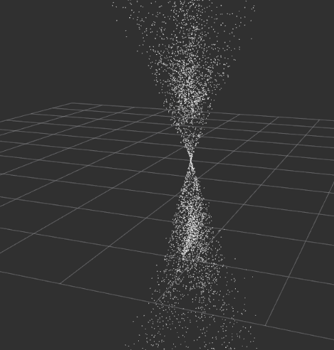

which didn’t really tell us what was wrong with our implementation. We weren’t exactly sure how to debug this from here, so we figured it’d be a good idea to at least get things running with the standard datasets instead of our custom dataset to make sure that this wasn’t caused by an issue with our camera calibration matrix.

After loading up the same dataset as the book ([reference](https://github.com/openMVG/SfM_quality_evaluation/tree/master/Benchmarking_Camera_Calibration_2008/fountain-P11/images)), we were still getting extremely poor results, so we knew that the problem was more fundamental than just our camera calibration matrix being off.

We then attempted to visualize the computed relative camera positions, like so:

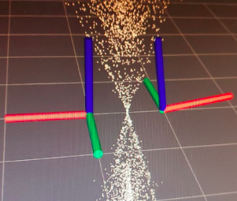

While the z-axes were positioned as we’d expect, it seemed bizarre to us that the cameras were rotated almost 180 degrees off of each other since both images were taken with a camera that was right-side-up. We thought it might have something to do with our keypoint detection, so we went one step back and looked at the keypoint matches. When we did this, we found lots of matches that didn’t look right, and needed to adjust the ratio threshold for Lowe’s ratio test in order to improve our correspondences. After a bit of tuning, our correspondences looked a lot better.

We also checked the epipolar lines - there were far too many lines to visualize, so we down-sampled a bit to get a better idea of what was going wrong

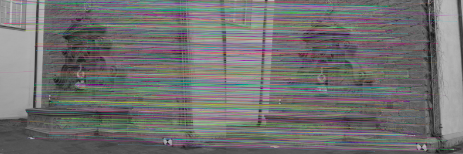

At this point, we were pretty confident in our keypoint matching since our correspondences and epipolar lines looked pretty good. Around this time, we also extracted color for each of our keypoints to make a colored pointcloud but our results were still not on par with what we expected to see.

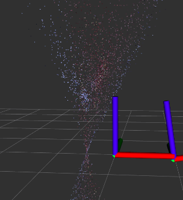

We realized that we had been visualizing our camera incorrectly all along - OpenCV returns the transform between the second camera to the first camera while we had been visualizing the inverse of that transform, so that needed to be fixed. After fixing that issue, our camera positions looked good, but our pointcloud was still far from what we expected

At this point, we finally narrowed down our problem to be an issue with the triangulation function. We still aren’t sure what was wrong with our original approach, but after replacing our function with the OpenCV function, we got promising results.

Through this project, we also ran into a number of other less interesting issues that just took some time to find solutions to, including:
+ compiler issues with C++ and environment setup with OpenCV
+ random seg faults from not declaring variables properly
+ the OpenCV version used in the book was incompatible with the OS versions we were using
+ NVIDIA driver issues causing RVIZ to act weird

## Lessons Learned
We learned several important lessons as we worked through this project. Some of our key lessons learned include:
+ _Just because you found a tutorial that includes example code, that doesn’t mean you’ll be able to compile it._ Don’t count on old code working.
+ _External C++ libraries (OpenCv in our case) can take an extremely long time to compile and set up properly._ This is especially true if this is your first time with said library. Start tackling this early and take the time to work through it. There’s not much pressure to rush when you’re just starting a project. Slow and steady compiles the code, and third compilation’s the charm.
+ _Sometimes you just won’t find the root cause of a problem. Just patch it and move on._ At one point, we had fully functional code on one machine that behaved unexpectedly on the other machine. Even after triple checking the code was the same and matching setups as closely as possible, we just couldn’t make it work. Instead, we tweaked the code slightly to make it work on both machines properly. This was probably much better than wasting time with a deep seeded bug, at least for a short project.

But the biggest lesson we learned is that choosing a good partner is just as valuable as choosing a good project. Having worked well together before on previous projects, we were excited to tackle _something_ in the computer vision space together, regardless of the exact problem. Having worked well together before, and having similar levels of background experience in robotics, ROS, and C++, we were able to both learn from each other and our project as we developed our code. This made the engaging parts far more engaging and the painful parts a bit less painful.

## Future Work
From here, we could invest more time into making our 3D reconstruction denser, but since our eventual goal was SLAM, this would be unnecessary. In order to have these results be useful for odometry or localization, we’d need a few more components:
+ A way to get scale
+ Multi-view reconstruction
+ Reconstruction from a live video feed
